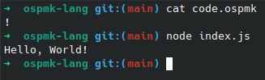

# OSPMK Programming language

> Очень Странный Простой Малофункциональный Кроссплатформенный Язык Программирования

## Screenshot of work

## Commands
| Command    | Description                                                | JavaScript                     |
| ---------- | ---------------------------------------------------------- | ------------------------------ |
| `!`        | Print "Hello, World!" in the console                       | `console.log("Hello, World!")` |
| `@`        | Init `counter` with default value (0) / set `counter` is 0 | `counter = 0`                  |
| `>`        | Increment counter by 1                                     | `counter++`                    |
| `<`        | Decrement counter by 1                                     | `counter--`                    |
| `?`        | Print value of `counter` to console                        | `console.log(counter)`         |
